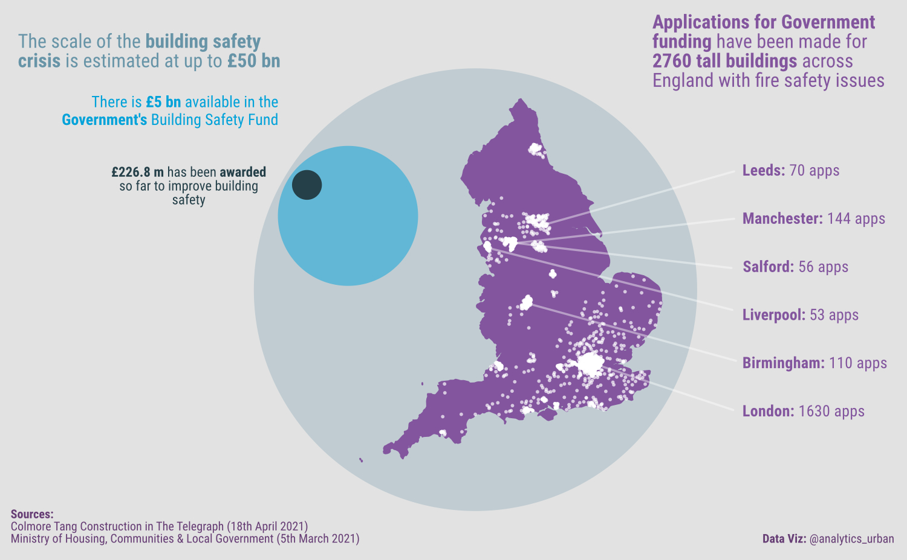
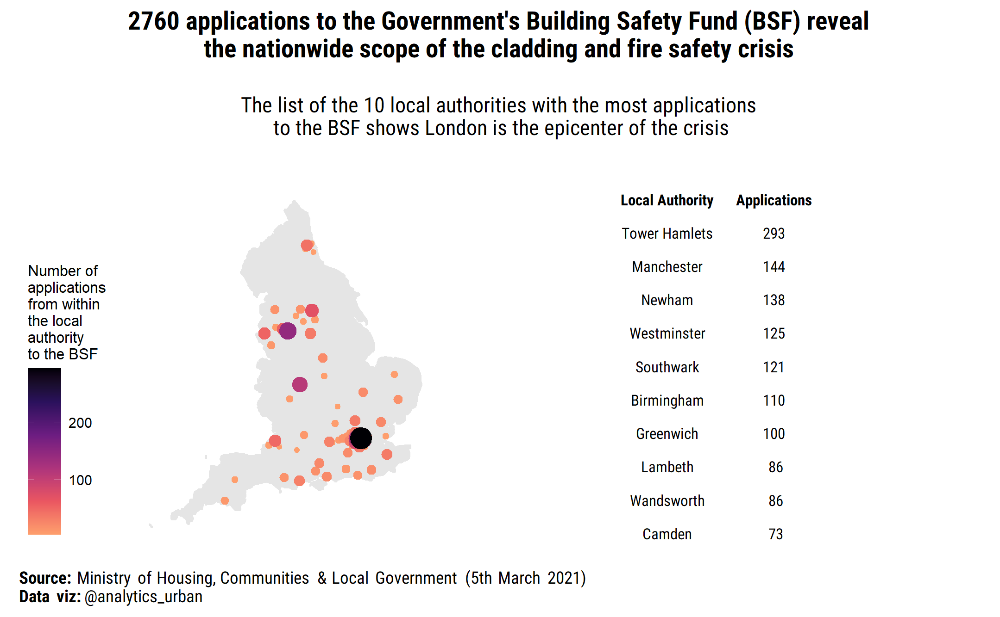

***In the interests of full disclosure:** I have been, and continue to be, personally affected by the cladding and building safety crisis.*

&nbsp;

Last week I put together an infographic (shown above) which I hoped would help with the campaigns for a comprehensive Government intervention to resolve the cladding and building safety crisis. The map within the infographic was picked up by BBC News, and was shown very briefly in the background of a feature on the News at Ten (Thursday 29th April).

This media coverage was a success in a very narrow personal sense, and obviously took place in the context of huge disappointment for the cladding/building safety campaign with the Fire Safety Bill passing parliament without financial protection for leaseholder. But, in this context I did want to document this small success. In particular, I wanted to document what my objectives were with the map visualisation, and also outline the limitations of the data plotted on the map. Primarily, this is for my own portfolio, but also just in case it is of interest to anyone else working on mapping the building safety crisis.

&nbsp;

## Objectives

The primary intended audience of the infographic was people involved in the cladding and building safety campaign. I hoped it would help people to see the national scale of the issues. The secondary audience was policy-makers and politicians involved in addressing the crisis, who might see the infographic if it was used widely by campaigners. More specifically, my objectives were:

-   To produce a visual engaging and impactful infographic, which could be understood by the audiences identified above;

-   To give a sense of the scale and geographic spread of the cladding and building safety crisis based the coarse grain data which been made available by Government ;

-   To highlight that many of the applications to the Government's Building Safety Fund are from large cities (London, Manchester, Birmingham etc.).

&nbsp;

## Limitations of the data available

Moving on to the limitations of the data used and the map itself. There is relatively little data openly available from Government on the scale and geographic spread of the Building Safety Crisis. An issue that some [campaigners](https://claddingscandalmap.co.uk/) have been addressing recently by crowdsourcing data on affected buildings. With the data being provided directly by the leaseholders involved, who can face bills ranging from £10,000 to £100,000 plus to rectify fire safety issues in their buildings.

Some data is available from Government which includes [the number of applications that have been made to its Building Safety Fund](https://www.gov.uk/guidance/remediation-of-non-acm-buildings#building-safety-fund-registration-statistics). In the map above, I used the '[Building Safety Fund: registration by local authority](https://assets.publishing.service.gov.uk/government/uploads/system/uploads/attachment_data/file/945322/MHCLG_BSF_and_ACM_BSF_by_Local_Authority.ods)' data. More specifically, the version of this data associated with a release made on 5th March 2021. It looks like the version of data I used has been replace with an updated version. Unfortunately, I can't find the exact version of the data I used on the MCHLG website anymore, so I can't provide a link here.

The data itself is very simple. Just a list of local authorities and count of the number of applications made to the Building Safety Fund from which each local authority.

+---------------------------------------------------+------------------+
| **Local Authority**                               | **Count**        |
+===================================================+==================+
| Barking and Dagenham                              | 24               |
+---------------------------------------------------+------------------+
| Barnet                                            | 37               |
+---------------------------------------------------+------------------+
| ...                                               | ...              |
+---------------------------------------------------+------------------+
| Worcestershire                                    | 8                |
+---------------------------------------------------+------------------+

Given the data I was working, the map itself has the following main limitations.

-   Applications to the Building Safety Fund (BSF) do not represent the full scale of the crisis. This is because the fund is only open to some buildings, and only covers a subset of the fire safety issues that have been uncovered in buildings post-Grenfell. More specifically, the fund supports "[the remediation of unsafe non-ACM cladding system on residential buildings 18 metres and over in both the private and social housing sectors](https://www.gov.uk/guidance/remediation-of-non-acm-buildings)". So, for example, a building over 18 meters tall with wooden balconies and compartmentalisation issues would be unlikely to be eligible for the fund. While any building under 18 meters with any issues would not be eligible for the fund. The New Build Database helpfully highlight this limitation when [retweeting the infographic](https://twitter.com/nbdbuk/status/1387481820506251266).


-   The map doesn't attempt to plot exact locations of buildings that have applied. This is because the data from the Government just lists the number of applications to the BSF per Local Authority area (as discussed above). I think there are some security concerns within Government around releasing more geographically specific data.

-   As a result, on the map I produced in each Local Authority the appropriate number of applications (i.e. dots) are shown at randomly selected locations. So, one can't look for a specific building that has applied to the Building Safety Fund on the map.

-   The exact location where each point is plotted with each Local Authority varies each time the code is run. This is because the locations allocated to each application within each Local Authority are sampled at random.

&nbsp;

## Reflections

-   I was pleased with that final map figure met the objectives I had started with: giving a sense of the scale and scope of the issue; and, highlighting that many of the applications come from large cities.

-   I had tried other approaches to visualizing the data. For example, I tried a choropleth map approach but found this made the building safety issues look rather small for two reasons. First, applications for BSF disproportionately come from smaller, urban local authorities. So, when viewed from a national scale the affected areas appear small relative to large rural local authorities (where no buildings have applied to the BSF). Secondly, the heavily right-skewed distribution of local authority application counts made colour scaling challenging.

-   I also tried plotting a single dot for each local authority, with the size and colour of each dot scaled by the number of application made to the BSF. See plot below. However, I there were problems with overplotting and the over map lacked visual impact.



-   I was also pleased with the way in which I combined map with the nested area chart.

-   In retrospect I could have spent more time on the refining/simplifying the colour palette used in the infographic and the approach to labeling of the cities with the most BSF applications.

&nbsp;

## Code

Below, is the (R) code I wrote to produce the map (just in case any one is interested) ...

```{r setup, include=FALSE}
knitr::opts_chunk$set(echo = TRUE,
                      message = FALSE,
                      warning = FALSE)
```

```{r}
# import packages used in this notebook
suppressPackageStartupMessages({
  suppressWarnings({
    
    # for data wrangling
    library(tidyverse)
    
    # for working with geospatial data
    library(sf)
    
    # for background layers for the map plot
    library(rnaturalearth)
    library(rnaturalearthdata)
    
    # for styling ggplot map output
    library(ggthemes)
  })})
```

```{r, skimr_include_summary = FALSE}
#******************************************************************************
# READ IN AND PROCESS DATA REQUIRED TO CREATE THE PLOT
#******************************************************************************

# get background layer for the map from a package
england <- ne_states(geounit = "england", returnclass = "sf")

# read MCLG in data (counts of BSF applications)
# cross check with .csv - there should be 81 rows (excluding column names)
la_data <- read_csv("MHCLG_BSF_and_ACM_BSF_by_Local_Authority.csv", skip = 1)

# read in shapefiles for LA boundaries
boundaries_lat_long <- st_read("boundaries_2019/Counties_and_Unitary_Authorities_(December_2019)_Boundaries_UK_BUC.shp") %>% 
  st_transform(4326) # set crs to match the background map

# merge LA boundaries and BSF application counts
bsd_geo <- merge(boundaries_lat_long,
                 # rename variable to so there is a shared key between the two
                 # datasets
                 la_data %>% 
                   rename(ctyua19nm = `Local Authority`)
) %>% 
  arrange(Count) %>% 
  
  # include to check that for a single Local Authority points are approx.
  # within boundaries of the Local Authority
  # filter(ctyua19nm == "Brighton and Hove") %>% 
  {.}

# confirm number of local authorities in merged  dataset
# there should be 80 features / 80 unique Local Authority names 
# (rather than 81 as the total in la_data won't match a geometry in the LA boundaries dataset)
bsd_geo %>%
  select(ctyua19nm) %>%
  as_tibble() %>% 
  distinct(ctyua19nm)

# confirm that data for key variables is complete
bsd_geo %>% 
  skimr::skim(ctyua19nm, Count)

# confirm no NAs in geometry columns 
# (as not sure if skimr work with geometries - see warning message)
print(glue::glue("Number of LAs with no geometry: {sum(is.na(bsd_geo$geometry))}"))
```

When randomly selecting locations within each Local Authority the follow message printed to the console "although coordinates are longitude/latitude, st_intersects assumes that they are planar". [Having read up on this](https://community.rstudio.com/t/how-to-project-crs-correctly/48595/5), it does not appear to be any cause for concern as the message relates to the age old challenge of projecting 3-D geographic features to a 2-D diagram. Given the geographic features being sampled here are relatively small (local authorities), and the purpose of the plot illustrative, then choice of crs/projection was not particularly important and I settled with using a widely used standard (WGS84).

```{r}
#******************************************************************************
# SIMULATE LOCATIONS OF BSF APPLICATION (WITH EACH LOCAL AUTHORITY)
#******************************************************************************

# create a vector of the application counts for each Local Authority
num_dots <- as.data.frame(bsd_geo) %>% 
  select(Count) 

# confirm the total number of application is correct
print(glue::glue("Number of dots to be plotted: {sum(num_dots)}")) # should be 2760

# for each LA generate an appropriate number of random points within it's boundaries
# one point per application
buildings <- st_sample(bsd_geo, size = num_dots$Count, type = "random")
```

```{r}
#******************************************************************************
# CONSTRUCT THE PLOT
#******************************************************************************

# print details of the layer ahead of plottin to confirm:
# the correct number of locations for applications have been simulated
# and all layers use the same CRS (WGS 84)
buildings # there should be 2760 features in the output 
england 
boundaries_lat_long

ggplot() +
  
  # plot background map
  geom_sf(data = england, colour = "grey90", fill = "grey90") +
  
  # option to superimpose LA boundaries to visually check that points create fall
  # with boundaries
  #geom_sf(data = boundaries_lat_long) +
  
  # plot simulated locations of the applications
  geom_sf(data = buildings, size = 1, alpha = 0.2) +
  
  # use minimal map theme to remove visual clutter
  theme_map() +
  
  # set coordinate system
  coord_sf()

#******************************************************************************
# COLOURING OF THIS PLOT AND ASSEMBLY OF THE INFOGRAPHIC
# COMPLETED IN AFFINITY DESIGNER
#******************************************************************************
ggsave("out.svg")
```

Finally, I wanted to identify the cities with the most applications to the BSF for labeling on the map. The required a little bit of coding (see below) as London is broken down into multiple local authorities.

```{r}
# read in ons data set which provides a lookup between local authorities
# and regions
# in the language of UK admistrative geography London is considered a region
la_region <- read_csv("https://opendata.arcgis.com/datasets/6a41affae7e345a7b2b86602408ea8a2_0.csv")

# join the lookup with the BSF data
la_data_regions <- la_data %>% 
  left_join(la_region, by = c("Local Authority" = "LAD21NM")) %>% 
  filter(!is.na(`Local Authority`))

# identify total number of applications from London LAs
num_london_apps <- la_data_regions %>% 
  filter(RGN21NM == "London") %>% 
  summarise(london_total = sum(Count)) %>% 
  pull()

# create a new dataframe without London LAs
la_data_regions_simp <- la_data_regions %>% 
  filter(RGN21NM != "London" | is.na(RGN21NM)) %>% 
  select(`Local Authority`, Count) %>% 
  
  # add a row for London (as a single entity)
  add_row(`Local Authority` = "London", Count = num_london_apps)

# confirm after aggregating counts for London Local Authorities the 
# total number of applications is as expected
sum(la_data_regions_simp$Count) # should be 2760

# output the top 6 cities by number of applications to the BSF
top_cites <- la_data_regions_simp %>% 
  slice_max(Count, n = 6)
top_cites
```
